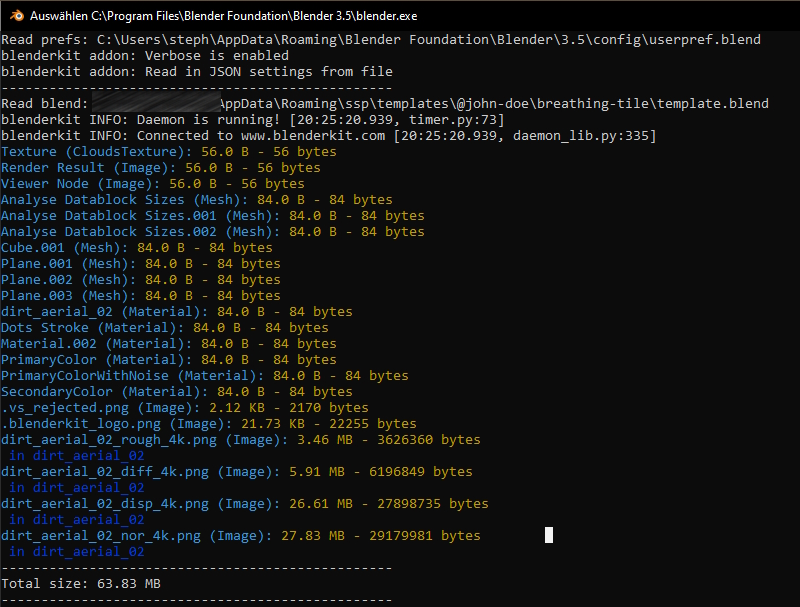

# BlockBuster - Inspect Blender Datablock Sizes

BlockBuster is a Blender addon that allows you to quickly and easily inspect the size of your Blender datablocks, including meshes, textures, materials, and more. With BlockBuster, you can identify and optimize the largest datablocks in your scene to improve performance and reduce memory usage.

## Features

- Inspect the size of individual datablocks or all datablocks in the current Blender scene
- Display the size of each datablock in bytes, kilobytes, megabytes, or gigabytes
- List the objects that are connected to a datablock, including linked duplicates and instances
- Sort datablocks by size to quickly identify the largest ones

## Installation

1. Download the latest release of BlockBuster from the [Releases](https://github.com/s-a/BlockBuster/releases) page.
2. In Blender, go to Edit > Preferences > Add-ons > Install.
3. Navigate to the downloaded ZIP file and select it.
4. Enable the BlockBuster addon by checking the checkbox next to its name.

## Usage

Just click the new button in Blender' s topbar main menu and open the system console (`Windows/Toggle System Console`).

## Contributing

BlockBuster is an open-source project and contributions are welcome! If you have a feature request or bug report, please [create an issue](https://github.com/s-a/blockbuster/issues). If you'd like to contribute code, please fork the repository and submit a pull request.

## License

BlockBuster is licensed under the MIT License.